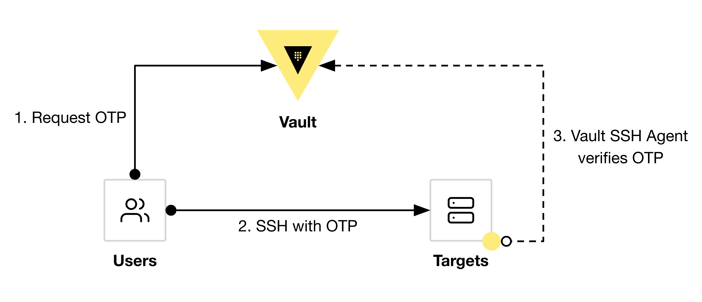

# Vault SSH OTP Demo

### Overview
The One-Time SSH Password (OTP) SSH secrets engine type allows a Vault server to issue a One-Time Password every time a client wants to SSH into a remote host using a helper command on the remote host to perform verification.

- https://developer.hashicorp.com/vault/tutorials/secrets-management/ssh-otp
- https://developer.hashicorp.com/vault/docs/secrets/ssh/one-time-ssh-passwords


### Diagram
<p align="center">
  
</p>


### Infrastructure Setup
```shell
git clone ...
cd ./vault-ssh-otp-demo/tf
terraform init
terraform apply
export VAULT_ADDR=$(terraform output -raw vault_addr)
export VAULT_TOKEN=$(terraform output -raw vault_token)
```

### Vault Setup
```shell
vault status

vault secrets list

vault secrets enable ssh

vault write ssh/roles/security \
  key_type=otp \
  default_user=ubuntu \
  cidr_list=0.0.0.0/0
```

### Vault Usage
```shell 
export REMOTE=$(terraform output -raw demo_ip)

vault write ssh/creds/security ip=$REMOTE

ssh ubuntu@$REMOTE
exit
# retry with same key (should fail)
ssh ubuntu@$REMOTE

# All in one command
vault ssh -role=security -mode=otp ubuntu@$REMOTE
```
